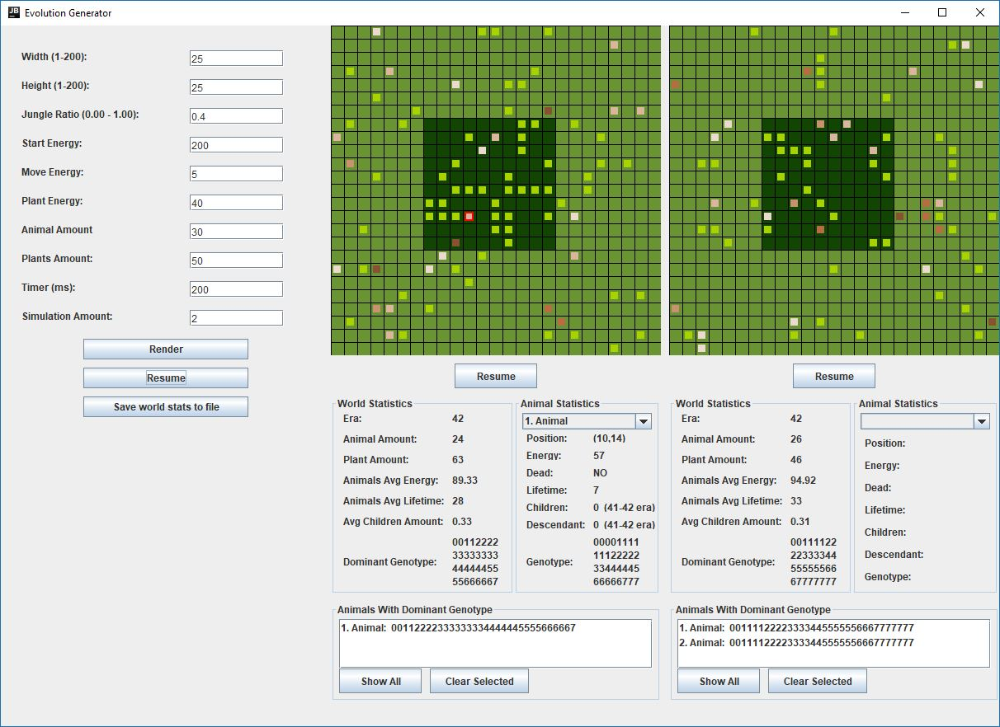

# Evolution Generator
Objected Oriented Programming Project

## Description
Program shows evolution of animals through out ther eras. It shows rendered map, statistics of world, selected animal statistics and animals with dominant genotype. Statistics that sum up whole simulation can be saved to stats.txt.

### Used Files
* parameters.json - standard parameters for inputs 
* stats.txt - statistics are saved to this file

### Used Libraries
* junit (junit:junit:4.12) - library for tests
* json-simple (com.googlecode.json-simple:json-simple:1.1.1) - library for reading json files
